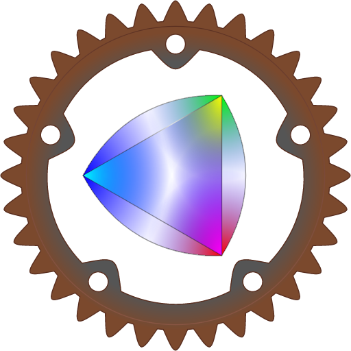

#  Safe Rust bindings to the [Skia Graphics Library](https://skia.org/).

[](https://crates.io/crates/skia-safe) [](LICENSE) [](https://dev.azure.com/pragmatrix-github/rust-skia/_build/latest?definitionId=2&branchName=master)

Skia Submodule Status: chrome/m88 ([upstream changes][skia-upstream], [our changes][skia-ours]).

[skia-upstream]: https://github.com/rust-skia/skia/compare/m88-0.37.0...google:chrome/m88
[skia-ours]: https://github.com/google/skia/compare/chrome/m88...rust-skia:m88-0.37.0

## Goals

This project provides _up to date_ safe bindings that bridge idiomatic Rust with Skia's C++ API on desktop and mobile platforms, including GPU rendering backends for [Vulkan](https://en.wikipedia.org/wiki/Vulkan_(API)), [Metal](https://en.wikipedia.org/wiki/Metal_(API)), [OpenGL](https://en.wikipedia.org/wiki/OpenGL), and [Direct3D](https://en.wikipedia.org/wiki/Direct3D).

## Status

### Documentation

Because we [can't build on docs.rs](https://docs.rs/crate/skia-safe/0.34.0/builds), the `cargo doc` output for skia-safe is manually created and uploaded to [rust-skia.github.io](https://rust-skia.github.io/doc/skia_safe).

We are [planning to add function level documentation](https://github.com/rust-skia/rust-skia/issues/23) by linking to Skia's documentation through [intra doc links](https://github.com/rust-lang/rfcs/blob/master/text/1946-intra-rustdoc-links.md), which should be stabilized soon.

### Crate

A prerelease crate is available from [crates.io](https://crates.io/crates/skia-safe) and adding

```toml
[dependencies]
skia-safe = "0"
```

to your `Cargo.toml` should get you started.

**On Linux** you may run into trouble when **OpenSSL libraries** are missing. On **Debian** and **Ubuntu** they can be installed with:

```bash
sudo apt-get install pkg-config libssl-dev
```

For other platforms, more information is available at the [OpenSSL crate documentation](https://docs.rs/openssl/0.10.24/openssl/#automatic).

### Platform Support, Build Targets, and Prebuilt Binaries

Because building Skia takes a lot of time and needs tools that may be missing, the skia-bindings crate's `build.rs` tries to download prebuilt binaries from [the skia-binaries repository](<https://github.com/rust-skia/skia-binaries/releases>).

| Platform | Binaries |
| -------- | -------- |
|  Windows | `x86_64-pc-windows-msvc` |
| Linux Ubuntu 16, 18<br />CentOS 7, 8 | `x86_64-unknown-linux-gnu` |
| macOS    | `x86_64-apple-darwin` |
| Android  | `aarch64-linux-android`<br/>`x86_64-linux-android` |
| iOS      | `aarch64-apple-ios`<br/>`x86_64-apple-ios` |

There no support for WebAssembly yet. If you'd like to help out, take a look at issue [#39](https://github.com/rust-skia/rust-skia/issues/39).

### Wrappers & Codecs & Supported Features

The supported wrappers, Skia codecs, and additional Skia features are documented in the [skia-safe package's readme](skia-safe/README.md). Prebuilt binaries are available for most feature combinations.

## Building

If the target platform or feature configuration is not available as a prebuilt binary, skia-bindings' `build.rs` will try to build Skia and generate the Rust bindings. 

To prepare for that, **LLVM** and **Python 2** are needed:

**LLVM**

We recommend the version that comes preinstalled with your platform, or, if not available, the [latest official LLVM release](http://releases.llvm.org/download.html). To see which version of LLVM/Clang is installed on your system, use `clang --version`. 

**Python 2**

Python version 2.7 _must_ be available.

The build script probes for `python --version` and `python2 --version` and uses the first one that looks like a version 2 executable for building Skia.

### On macOS

- Install the Command Line Tools for Xcode with

  ```bash
  xcode-select --install
  ```

  or download and install the [Command Line Tools for Xcode](https://developer.apple.com/download/more/).

- **macOS Mojave only**: install the SDK headers:

  ```bash
  sudo open /Library/Developer/CommandLineTools/Packages/macOS_SDK_headers_for_macOS_10.14.pkg
  ```

  If not installed, the Skia build _may_ fail to build `SkJpegUtility.cpp` and the binding generation _will_ fail with  `'TargetConditionals.h' file not found` . Also note that the Command Line Tools _and_ SDK headers _should_ be reinstalled after an update of XCode.

- As an alternative to Apple's XCode LLVM, install LLVM via `brew install llvm` or `brew install llvm` and then set `PATH`, `CPPFLAGS`, and `LDFLAGS` like instructed. 

  If the environment variables are not set, [bindgen](https://github.com/rust-lang/rust-bindgen) will most likely use the wrong `libclang.dylib` and cause confusing compilation errors (see #228).

### On Windows

- Have the latest versions of `git` and Rust ready.

- [Install Visual Studio 2019 Build Tools](https://visualstudio.microsoft.com/downloads/) or one of the IDE releases. If you installed the IDE, make sure that the [Desktop Development with C++ workload](https://docs.microsoft.com/en-us/cpp/build/vscpp-step-0-installation?view=vs-2019) is installed.

- Install the [latest LLVM](http://releases.llvm.org/download.html) distribution.

  If the environment variable `LLVM_HOME` is not defined, the build script will look for LLVM installations located at `C:\Program Files\LLVM\`, `C:\LLVM\`, and `%USERPROFILE%\scoop\apps\llvm\current\`.
  
- [MSYS2](https://www.msys2.org/):
  
  - Install Python2 with `pacman -S python2`.
  
- Windows Shell (`Cmd.exe`):
  
  - Download and install Python version 2 from [python.org](https://www.python.org/downloads/release/python-2716/).
  
- Install and select the MSVC toolchain:
  ```bash
  rustup default stable-msvc
  ```

### On Linux

#### Ubuntu 16+

- LLVM/Clang should be available already, if not, [install the latest version](http://releases.llvm.org/download.html).

- If OpenGL libraries are missing, install the drivers for you graphics card, or a mesa package like `libgl1-mesa-dev`.

#### CentOS 7

- Install the following packages:

  ```bash
  sudo yum install gcc openssl-devel libX11-devel python2 fontconfig-devel mesa-libGL-devel
  ```

- [Install and enable the LLVM toolset 7](https://www.softwarecollections.org/en/scls/rhscl/llvm-toolset-7.0/)

- [Install and enable the Developer Toolset 8](https://www.softwarecollections.org/en/scls/rhscl/devtoolset-8/)

#### CentOS 8

- Install the following packages:

  ```bash
  sudo yum install gcc openssl-devel libX11-devel python2 clang fontconfig-devel mesa-libGL-devel
  ```

- Set `/usr/bin/python2` as the default `python` command:

  ```bash
  sudo alternatives --set python /usr/bin/python2
  ```

### For Android

Cross compilation to Android is supported for targeting 64 bit ARM and Intel x86 architectures (`aarch64` and `x86_64`) for API Level 26 (Oreo, Android 8):

For example, to compile for `aarch64`:

1. Install the rust target:
   ```bash
   rustup target install aarch64-linux-android
   ```
2. Download the [r21d NDK](https://developer.android.com/ndk/downloads) for your host architecture and unzip it.
3. Compile your package for the `aarch64-linux-android` target:

On **macOS**:

```bash
export ANDROID_NDK=:path-to-android-ndk-r21d
export PATH=$PATH:$ANDROID_NDK/toolchains/llvm/prebuilt/darwin-x86_64/bin
export CC_aarch64_linux_android=aarch64-linux-android26-clang
export CXX_aarch64_linux_android=aarch64-linux-android26-clang++
export CARGO_TARGET_AARCH64_LINUX_ANDROID_LINKER=aarch64-linux-android26-clang

cargo build -vv --target aarch64-linux-android
```

Note: we don't support Apple's Clang 11 to build for Android on macOS, so you need to install LLVM and set the `PATH` like instructed.

On **Linux**:

```bash
export ANDROID_NDK=:path-to-android-ndk-r21d
export PATH=$PATH:$ANDROID_NDK/toolchains/llvm/prebuilt/linux-x86_64/bin
export CC_aarch64_linux_android=aarch64-linux-android26-clang
export CXX_aarch64_linux_android=aarch64-linux-android26-clang++
export CARGO_TARGET_AARCH64_LINUX_ANDROID_LINKER=aarch64-linux-android26-clang

cargo build -vv --target aarch64-linux-android
```

On **Windows** the Android NDK clang executable must be invoked through `.cmd` scripts:

```bash
export ANDROID_NDK=:path-to-android-ndk-r21d
export PATH=$PATH:$ANDROID_NDK/toolchains/llvm/prebuilt/windows-x86_64/bin
export CC_aarch64_linux_android=aarch64-linux-android26-clang.cmd
export CXX_aarch64_linux_android=aarch64-linux-android26-clang++.cmd
export CARGO_TARGET_AARCH64_LINUX_ANDROID_LINKER=aarch64-linux-android26-clang.cmd

cargo build -vv --target aarch64-linux-android
```
_Notes:_

- The `CARGO_TARGET_${TARGET}_LINKER` environment variable name [needs to be all uppercase](https://github.com/rust-lang/cargo/issues/1109#issuecomment-386850387).
- In some older shells (for example macOS High Sierra), environment variable replacement can not be used when the variable was defined on the same line. Therefore the `ANDROID_NDK` variable must be defined before it's used in the `PATH` variable.
- Rebuilding skia-bindings with a different target may cause linker errors, in that case `touch skia-bindings/build.rs` will force a rebuild ([#10](https://github.com/rust-skia/rust-skia/issues/10)).

### For iOS

Compilation to iOS is supported on macOS targeting the iOS simulator (`--target x86_64-apple-ios`) and 64 bit ARM devices (`--target aarch64-apple-ios`). The ARM64**e** architecture is [not supported yet](https://github.com/rust-lang/rust/issues/73628).

### Skia

For situations in which Skia does not build or needs to be configured differently, we support some customization support in `skia-bindings/build.rs`. For more details take a look at the [README of the skia-bindings package](skia-bindings/README.md).

Please share your build experience so that we can try to automate the build and get to the point where `cargo build` _is_ sufficient to build the bindings _including_ Skia, and if that is not possible, clearly prompts to what's missing.

## Example Applications

### icon

The `icon` example generates the rust-skia icon in the current directory.
It computes the position of all the gear teeth etc. based on parameters such as the number of teeth and wheel radius.

If you were able to build the project, run

```bash
cargo run --example icon 512
```

It has a single optional parameter which is the size in pixels for the PNG file.
Without parameters, it’ll produce PNG frames for the animated version.

### skia-org

The other examples are taken from [Skia's website](https://skia.org/) and [ported to the Rust API](skia-org/).

```bash
cargo run -- [OUTPUT_DIR]
```

to generate some Skia drawn PNG images in the directory `OUTPUT_DIR`. To render with OpenGL, use

```bash
cargo run -- [OUTPUT_DIR] --driver opengl
```

And to show the drivers that are supported
```bash 
cargo run -- --help
```

### gl-window

An example that opens an OpenGL Window and draws the rust-skia icon with skia-safe (contributed by [@nornagon](https://github.com/nornagon)).

```bash
(cd skia-safe && cargo run --example gl-window --features "gl")
```

## Example Images

Fill, Radial Gradients, Stroke, Stroke with Gradient, Transparency:
[](https://matracas.org/tmp/rust-skia-icon.html)

Fill, Stroke, Text:


Sweep Gradient:


Dash Path Effect:


For more, you may take a look at the [rust-skia.github.io](https://github.com/rust-skia/rust-skia.github.io/tree/master/skia-org/cpu) repository.

## This project needs contributions!

If you'd like to help with the bindings, take a look at the [Wiki](https://github.com/rust-skia/rust-skia/wiki) to get started and create an issue to prevent duplicate work. For smaller tasks, grep for "TODO"s in the source code. And for heroic work, check out the label [help wanted](https://github.com/rust-skia/rust-skia/labels/help%20wanted). And if you like to help making the Rust API nicer to use, look out for open issues with the label [api ergonomics](https://github.com/rust-skia/rust-skia/issues?q=is%3Aissue+is%3Aopen+label%3A%22api+ergonomics%22).

More details can be found at [CONTRIBUTING.md](https://github.com/rust-skia/rust-skia/tree/master/CONTRIBUTING.md).

## Notable Contributions

- Denis Kolodin ([@DenisKolodin](https://github.com/DenisKolodin)) added build support for Android.
- Alberto González Palomo ([@AlbertoGP](https://github.com/AlbertoGP)) designed the Rust-Skia Logo and the example program that renders it.

## Maintainers

- LongYinan ([@Brooooooklyn](https://github.com/Brooooooklyn))
- Armin ([@pragmatrix](https://github.com/pragmatrix))

## License

MIT

  
